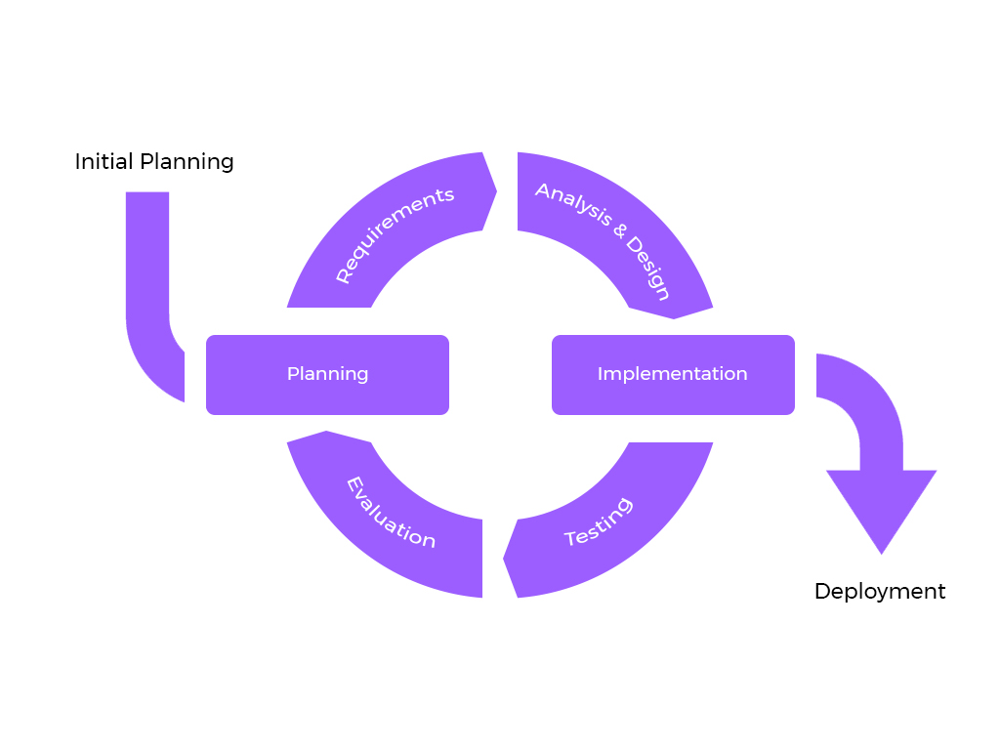

# Good Code
## Readable
Good code is easy to read, and hints towards the overall system architecture  

"Programs are meant to be read by humans and only incidentally for computers to execute" - Donald Kunth  

On the other hand, remember that code is also meant to be run on machines. Make sure your code doesn't run 100x slower than what is possible.   

Notes
* Its not a competition to make the most terse code, nor the most abstracted code
* This does not mean putting every little thing into a function
* See the article on Doom3 source code in the "Supplementary Materials" section at the end of this doc for more on this topic

Knowing how to write good code is an art

## Simplicity / Not Doing Too Much
The concept of keeping and making things simple is everywhere, in every dicipline. 

Don't...
* overthink
* prematurly optimize or abstract
* plan your entire project out in advance
* add unnecessary features 

Do...
* 80% of the work with 20% of the effort (The reading is about this)
* abstract when its actually clever and simplifies things
* optimize when you need the performance boost
* plan and code your project a little at at a time

Tip
* Unlearn many of the overabstracting and "planning the entire project before you wrote a line of code" tendencies you learned from OOP  

Lets take a look at how to develop projects using this principle 

# Iterative Development for Personal Development
Galls Law: "*A complex system that works is invariably found to have evolved from a simple system that worked.* A complex system designed from scratch never works and cannot be patched up to make it work. You have to start over with a working simple system."
- John Gall, Author of General systemantics: an essay on how systems work, and especially how they fail... (1975)

Don't do too much. This is applied to both Software and Business. Instead create something simple that works, then continuously improve it in little steps.

This is the foundation of *iterative development*

Plan => Code => Test => Repeat  

I don't really like these sort of diagrams because this makes it feel more strict than it actually is. So think of this as more of a loose suggestion. As long as the iteration is still there you're fine.

## MVP (Minimum Viable Product)
This is the one thing aside from iterating I require you do. ALWAYS build an MVP  

A MVP is the crappiest possible version of your idea. There are no optimizations and all the non required features are not implemented. Those will be implemented in later iterations. Your MVP should make you embarrassed.

Benefits:
* It will make programming 10x more enjoyable and prevent burnout because you actually have something that works - *This cannot be understated*
* Its much easier and faster to switch direction should the current direction not resonate with you or your clients in a business setting
* If you are leading a project, it will make things so much less stressful since you know you can always turn something in as your deliverable
    * I failed to do this my first TAMID project, have you ever pulled back to back all nighters during finals week on something not finals related?

## Recommendations 
* When doing initial planning, write down "user stories", basic actions you would like the user to be able to do
* Do your research on the topic (Read a paper or watch a video)
* Test things, this can be as simple as a print or assert statement. 

## Example: Mail Service
1. What are the user stories?
2. What is the MVP?

*We will add onto this model and make our approach more formal when we start thinking about industry code*

# Review
1. Good code is readable code
2. Keep it simple, don't do too much
3. Use short iterations during projects between planning and coding

# Whats Next
Research and how to Learn

# Homework
Topic: Not doing too much: Read [worse is Better](https://www.dreamsongs.com/WorseIsBetter.html)  

# Supplementary Material
Topic: writing good code: [The Exceptional Beauty of Doom 3 Source Code](https://kotaku.com/the-exceptional-beauty-of-doom-3s-source-code-5975610)
Topic: Iterative Development: [Machine Learning in C, Tsoding](https://youtu.be/PGSba51aRYU?si=7nKjCw9fQHmndpyH)
Pay attention to his development process. He did his research beforehand and knows what he generally wants. He created a very basic model makes sure its was correct with some print statements. Then he iterates. He thinks of an improvement, maybe does some googling, and then implements the change, and repeats this process.