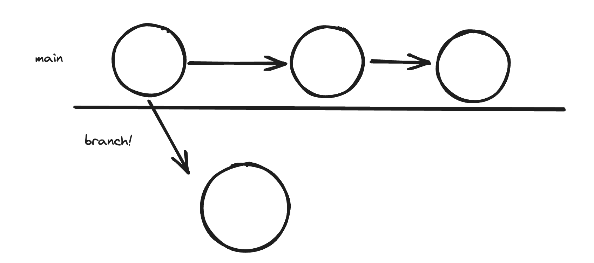
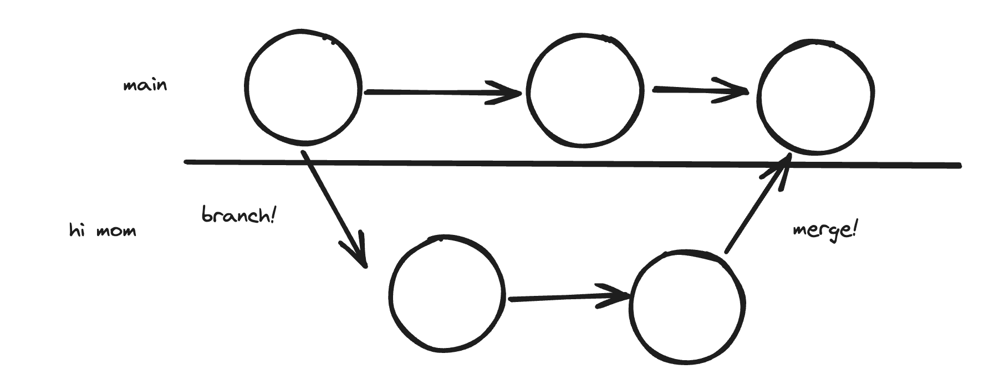

TODO: 
* Exercise 4, fix a merge conflict
* Pushing and pulling practice
* Pulling merge conflicts
* Pull requests
* amend

# Git

Git is all about creating checkpoints in your code. This enables you to go back into history, and makes its easier to work with other people.


(Explain main branch for prod and checkpoints)

Q: What if you accidentally just introduced a new bug into your codebase?  
A: Go back to previous checkpoints and see what changed!  

How do we do this?

We always need to create a repository, this is how our changes get tracked

*Show the .git folder being created, delete it, and reinitialize repo*

### Commits

How do we create these checkpoints

*Make changes; add / delete files*
1. Stage: Add to "staging area/index"
2. Commit
3. (Optional) Push (put the .git file online)

*Do exercise 1.1 with everyone*  
*Do exercise 1.2 with everyone*  
(Show git history, draw out history during)

### Branching and Merging

Main is for showing our clients and for production, but what if we want to try out features, or develop without making main buggy? This is why we create branches.

We create branches to work on some feature without affecting main 


*Do exercise 2 with everyone*

We will eventually *merge* them back in


Git is pretty good at knowing how to merge, but sometimes it requires manual intervention

*Do exercise 3 with everyone*

#### Merge Conflicts

This is not scary, some people make it seem like it is. 

Git will show you where it does not know how to merge due to ambiguity. You can then fix things up.

*Do exercise 4 with everyone*

*Challenge: Do exercise 5 individually*


### Review:

* What is git
* Creating a repository
* Creating commits (checkpoints)
* Branching
* Merging
* Handling merge conflicts

# Homework
* Read the manpage *gittutorial(7)* up to the section 'USING GIT FOR COLLABORATION'
* Skim the *giteveryday* manpage *"INDIVIDUAL DEVELOPER (STANDALONE)"* section

* Practice making commits, creating branches, creating conflicts, merging them
* Practice managing the index with *git add* and *git restore*
* Practice undoing commits with *git reset*

If you get stuck, read the manpages. Syntax is *man git-<command>* or *git help <commmand> as outlined in the *gitcli* manpage. Example:
```bash
man git-reset
# OR 
git help reset
```

If you are interested in learning more, follow the git(1) manpage. 

# Additional Notes
* Once we get to business development, we will discuss using git for collaboration
* If you would like additional practice with what we have learned, or would like to learn more, just mess around with git, and google things you don't understand. (Don't get caught in tutorial hell)
Q: What about github or bitbucket, or gitlab???  
A: Those are websites to store a copy of your .git folder. They make it easy for many people to work on the same project