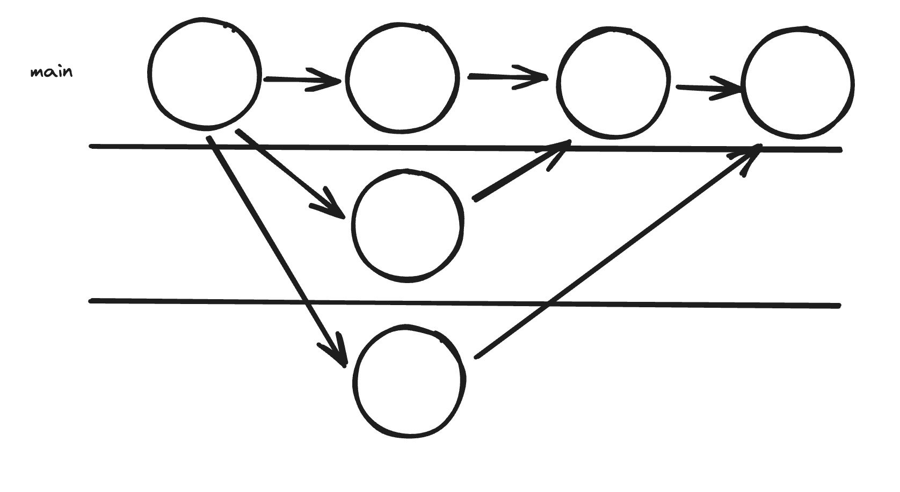

1. Creating repositories and commits
    1. Create a git history that looks like the following. You will have to create a git repository and make 3 commits. The contents of each commit can be whatever you like.
    
    2. Checkout your previous commits (move your head around)

2. Branching practice
You may use the repo from exercise 1. Create 2 branches, main and hi_mom. Main should say "hi dad", while hi_mom should say "hi mom". Draw this out first, and then do this in vscode.

3. Merging practice
Using the git repo from exercise 2, merge hi_mom into main.

4. Fix a merge conflict
TODO
run 
``` bash
git clone <URL>
```
Then merge and fix the merge conflict

5. Create a git repo that looks like


6. Uploading to github
Upload your challenge (or any) git repository to github

7. Cloning from github
Go to github, find a trending project, and clone it onto your machine.

8. Pulling and pushing
Each member go around the room, pushing a change to our git repo.

9. Pulling and pushing with pull requests
Each member go around the room, making a pull request to our git repo.

