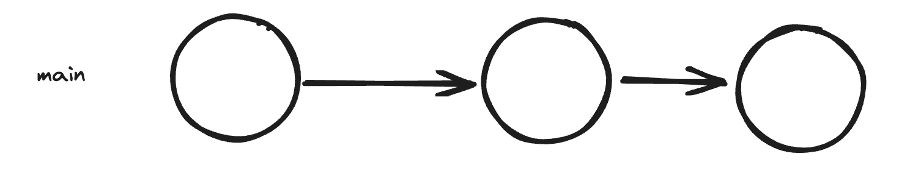
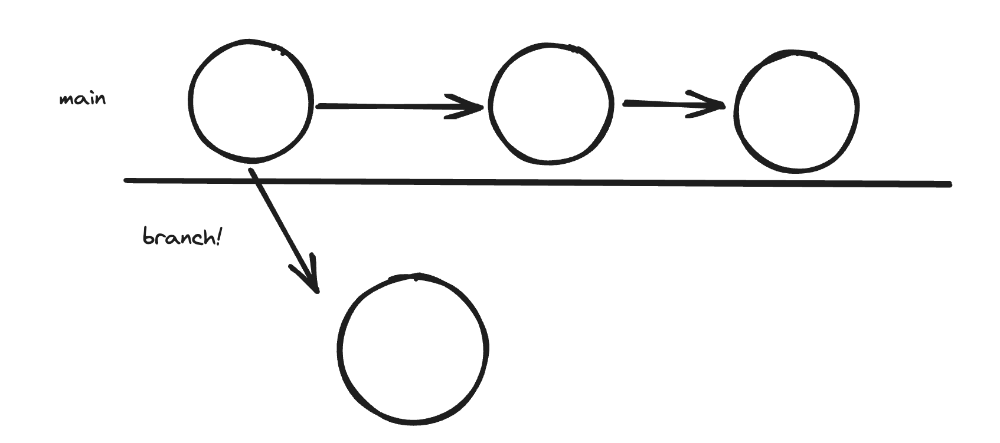
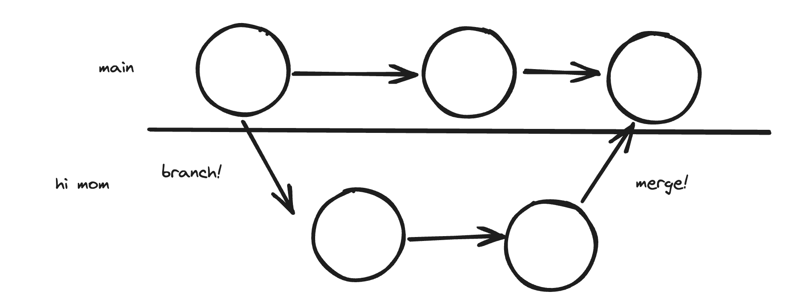

TODO: 
* Exercise 4, fix a merge conflict
* Pushing and pulling practice
* Pulling merge conflicts
* Pull requests

# Git

Git is all about creating checkpoints in your code. This enables you to go back into history, and makes its easier to work with other people.


(Explain main branch for prod and checkpoints)

Q: What if you accidentally just introduced a new bug into your codebase?
A: Go back to previous checkpoints and see what changed!

How do we do this?

We always need to create a repository, this is how our changes get tracked

*Show the .git folder being created, delete it, and reinitialize repo*

### Commits

How do we create these checkpoints

1. Stage
2. Commit
3. (Optional) Push (put the .git file online)

*Do exercise 1.1 with everyone*
*Do exercise 1.2 with everyone*
(Show git history, draw out history during)

### Branching and Merging

Main is for showing our clients and for production, but what if we want to try out features, or develop without making main buggy? This is why we create branches.

We create branches to work on some feature without affecting main 


*Do exercise 2 with everyone*

We will eventually *merge* them back in



Git is pretty good at knowing how to merge, but sometimes it requires manual intervention

*Do exercise 3 with everyone*

#### Merge Conflicts

This is not scary, some people make it seem like it is. 

Git will show you where it does not know how to merge due to ambiguity. You can then fix things up.

*Do exercise 4 with everyone*

*Do exercise 5 individual*

### Review:

* What is git
* Creating a repository
* Creating commits (checkpoints)
* Branching
* Merging
* Handling merge conflicts

# Remotes (Github, Gitlab, Bitbucket, etc)

At their most basic level: Just sites to store our .git folder!

Amazing for working as teams!

Q: What is our .git folder

*Do exercise 6 with everyone*

### Cloning

How do we get git repositories from github onto our machine?

``` bash
git clone <url>
```

*Do exercise 7 with everyone*

### Pulling and pushing

Q: How do you get the up to date version of the project?
Q: How do you upload your changes to github?
Q: What happens if you try to upload an outdated version of the project to github? 

A: Pull!
A: Push!
A: Pull, then push!

#### Resolving merge conflicts when pulling

If you have changes that the remote does not have, you may run into merge conflicts, simply fix them like how you usually fix merge conflicts. 

### Pull requests


### Remotes Review

* What is a remote
* Cloning
* Pulling
* Pushing
* Pull requests
* Resolving merge conflicts when pulling

# Additional Notes
* If you would like additional practice with what we have learned, or would like to learn more, just mess around with git, and google things you don't understand. (Don't get caught in tutorial hell)
* If you would like to learn how to use git in the terminal, google a git cheatsheet. Don't bother watching a video if you already understand the concepts, just practice by doing.